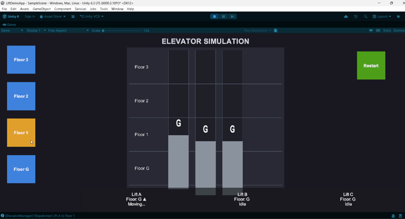

📌 Project Overview

This project is a 2D Elevator Simulation built using Unity Engine.
The system simulates multiple elevators responding to floor requests intelligently. The goal of this project is to demonstrate Unity UI implementation, programming logic, and structured code design.

The simulation contains multiple elevators, multiple floors, and an intelligent system that selects the nearest available elevator.

---

🎮 Features

🏢 3 Elevators (Lifts) operating simultaneously

🪜 4 Floors (Ground, Floor 1, Floor 2, Floor 3)

🔘 Floor Call Buttons for each floor

🚀 Nearest Elevator Selection System

🔄 Elevator Request Queue System

↕️ Smooth Elevator Movement between floors

📟 Current Floor Display for each elevator

🧠 Smart elevator response logic

---

 Demo

---

 📥 Installation

1. Clone the repository  
git clone https://github.com/adnanmohd9321/Unity-project.git

2. Open **Unity Hub**

3. Click **Add Project**

4. Select the downloaded **Unity-project folder**

5. Open the project in **Unity Engine**

6. Open the **Main Scene**

7. Press **Play ▶** to run the Elevator Simulation
